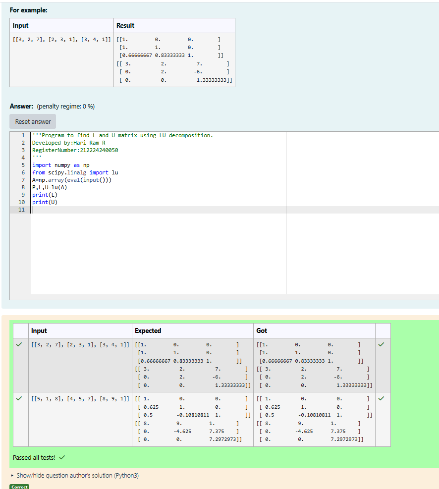
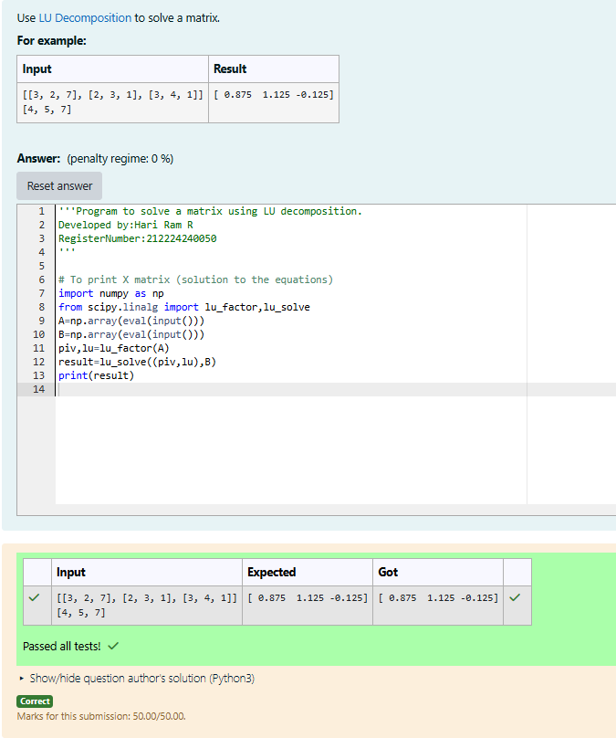

# LU Decomposition 

## AIM:
To write a program to find the LU Decomposition of a matrix.

## Equipments Required:
1. Hardware – PCs
2. Anaconda – Python 3.7 Installation / Moodle-Code Runner

## Algorithm
Step 1: Start the process.
Step 2: Input a square matrix A.
Step 3: Perform LU Decomposition to split A into matrices L (Lower triangular) and U (Upper triangular) using a suitable method.
Step 4: Extract and display matrices L and U.
Step 5: End the process.

## Program:
(i) To find the L and U matrix
```
'''Program to find L and U matrix using LU decomposition.
Developed by:Hari Ram R
RegisterNumber:212224240050
'''
import numpy as np
from scipy.linalg import lu
A=np.array(eval(input()))
P,L,U=lu(A)
print(L)
print(U)
```
## Algorithm
Step 1: Import NumPy and LU-related functions from SciPy.
Step 2: Input the coefficient matrix A and constant matrix B.
Step 3: Perform LU decomposition using lu_factor() and solve using lu_solve().
Step 4: Display the solution matrix X.
(ii) To find the LU Decomposition of a matrix
```
'''Program to solve a matrix using LU decomposition.
Developed by:Hari Ram R
RegisterNumber:212224240050 
'''
# To print X matrix (solution to the equations)
import numpy as np
from scipy.linalg import lu_factor,lu_solve
A=np.array(eval(input()))
B=np.array(eval(input()))
piv,lu=lu_factor(A)
result=lu_solve((piv,lu),B)
print(result)
```

## Output:



## Result:
Thus the program to find the LU Decomposition of a matrix is written and verified using python programming.
